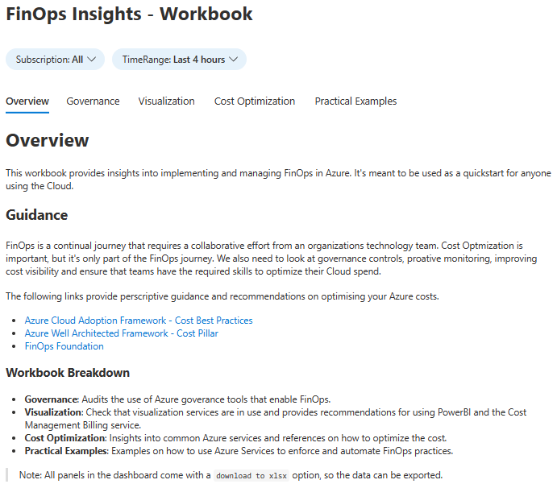
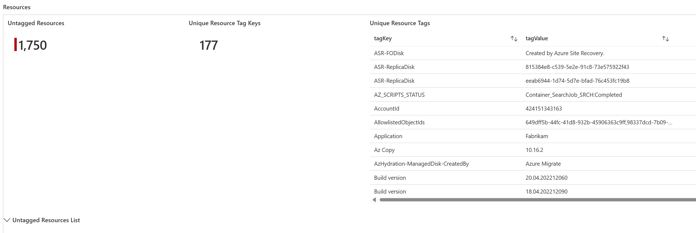
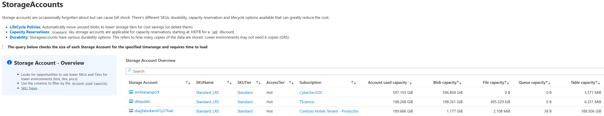
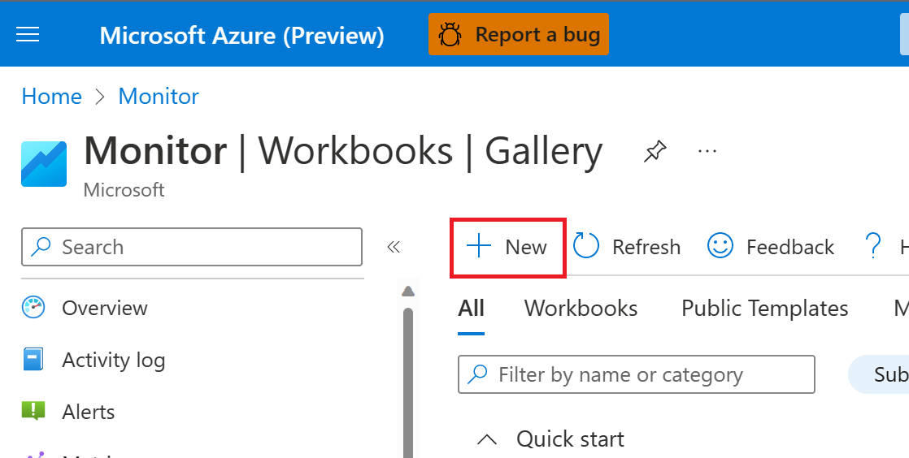
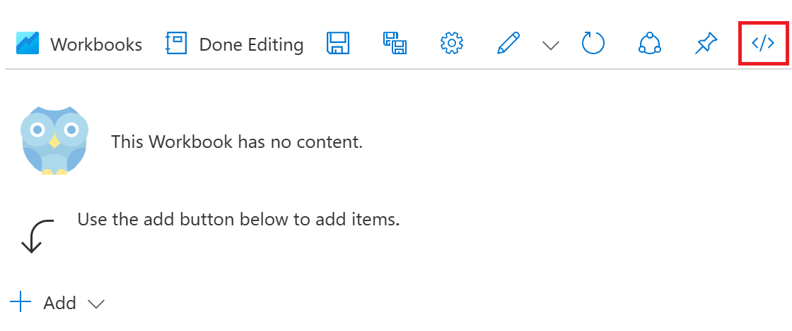
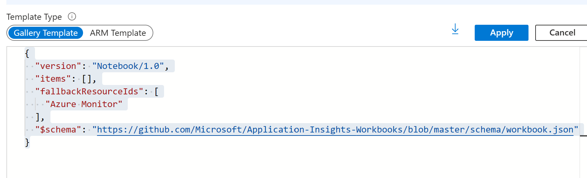
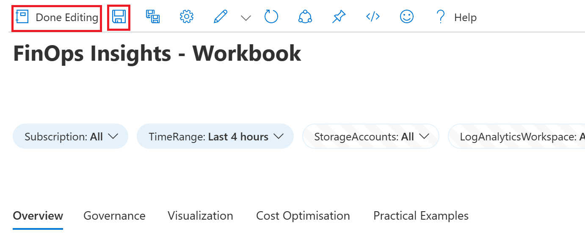

# Azure FinOps Workbook (Work In Progress)

## Overview

This repository contains an Azure Workbook (dashboard) which provides insights, key document and guidance on rolling out FinOps and Cost Optimization in Azure.

Data within your Azure environment is visualized along with the relevant recommendations and relevant guides. This encourages a data driven approach.

> **Note:** The Workbook is provided as an example and is a work in progress.

## What's Included?

- Hybrid License Audit

- Tagging Audit

- Practical FinOps / Automation examples

- Cost Optmization insights for Storage Accounts, AKS, Log Analytics, Orphan resources, Recovery services App Services and Virtual Machines.

## Requirements

To use this Workbook you will need Read Only access to the resources you're investigating in Azure. But to save the Workbook you need permissions to create an Azure Workbook.

> **Recommendation**: Read only access over the entire subscription / management groups will light up all the panels of the Workbook.

## How To

To use this Workbook you need to:

1. Copy the content from the file `workbook.json`.

2. Open the [Azure Workbook](https://ms.portal.azure.com/#view/Microsoft_Azure_Monitoring/AzureMonitoringBrowseBlade/~/workbooks/menuId/workbooks) page and click `New`.

3. Click on the `code` button.

4. Paste the content copied in step 1 into the page and click `Apply`.

5. Save the Workbook (if you have permissions) and click `Done Editing`.

## What's Coming

- Uplift the Virtual Machine page
- Add ASEv3 views to the App Service page
- Blob inventory by access tier
- Fixing the AKS Node & SystemNode size checks (moving to Regex check)
- Grammar
- A PowerBI PBX for quick provisioning
- Dark mode support

## Additional Documentation

- [Azure FinOps Guide - 2023](https://techcommunity.microsoft.com/t5/fasttrack-for-azure/the-azure-finops-guide/ba-p/3704132)
- [FinOps Foundation](https://www.finops.org/introduction/what-is-finops/)

## Troubleshooting

- **Throttling**: If you see any throttling errors, wait a minute and reduce the amount of `selected subscriptions` using the parameter at the top of the Workbook.

## Contributing

If you'd like to contribute, add improvements or fix any bugs, please reach out or raise an issue on the repository.
